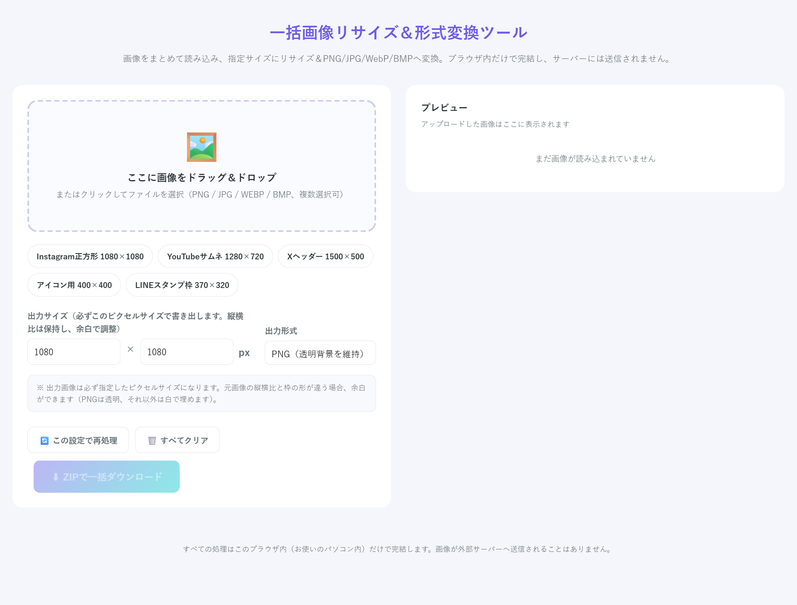
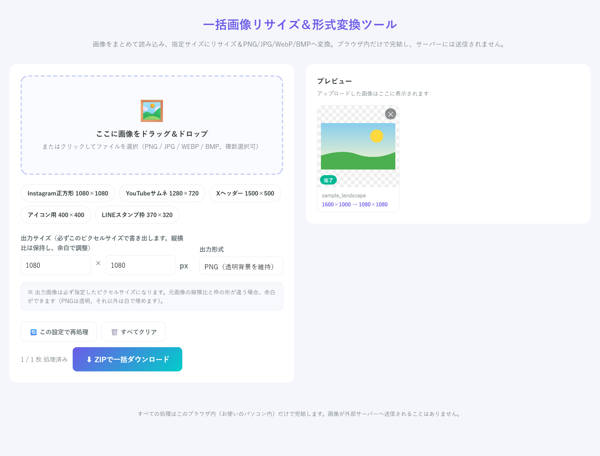
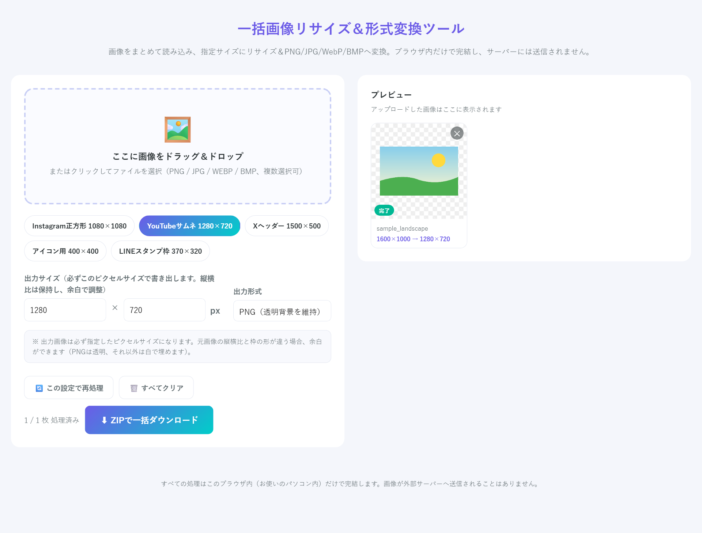
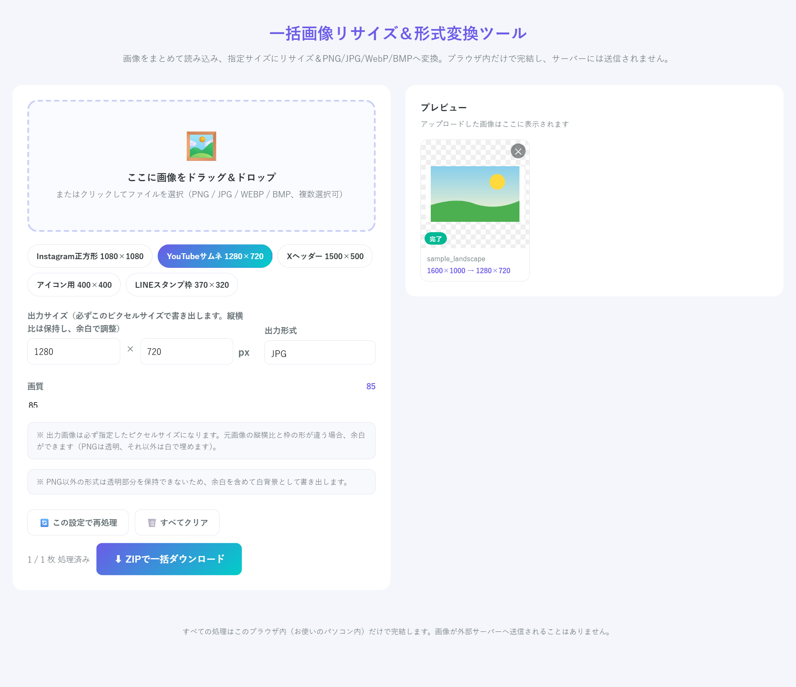
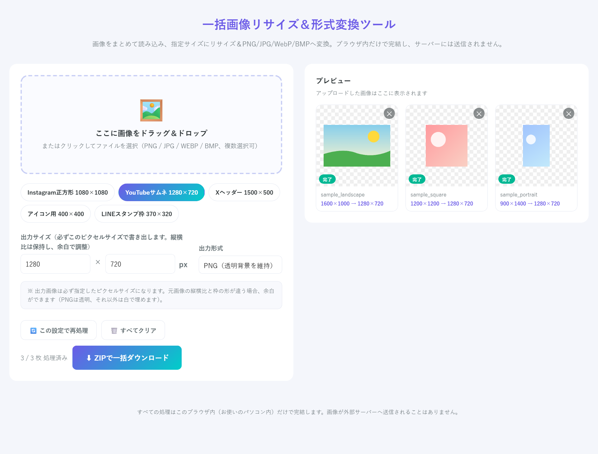

# 一括画像リサイズ＆形式変換ツール
### 使い方ガイド（画像付き）

このたびはご購入ありがとうございます。
インストール不要・アカウント登録不要で、今すぐ使えます。

---

## セットアップ（初回だけ・1分）

1. ダウンロードした **`一括画像リサイズ＆形式変換ツール.html`** を、デスクトップなど分かりやすい場所に保存
2. ファイルを **ダブルクリック** → ブラウザ（Chrome推奨）でツールが開きます

> 💡 「メモ帳」やコード画面で開いてしまった場合は、ファイルを右クリック →「プログラムから開く」→ **Google Chrome** を選んでください。
> インターネットに接続していなくても動きます。

開くと、こちらの画面が表示されます。左側が操作パネル、右側がプレビューエリアです。

---

## STEP 1｜画像をドラッグ＆ドロップ

左側の点線ワクに画像をドラッグ＆ドロップします（クリックしてファイルを選ぶこともできます）。対応形式は **PNG / JPG / WEBP / BMP**、複数枚まとめての読み込みもOKです。

読み込むと自動で処理が始まり、右側のプレビューにすぐ結果が表示されます。**変換前 → 変換後のサイズ**（例：`1600×1000 → 1080×1080`）もその場で確認できるので、アップロードできたかどうか迷うことはありません。

---

## STEP 2｜サイズを決める（プリセット or 直接入力）

よく使うサイズは、プリセットボタンをワンクリックするだけで入力できます。

| ボタン | サイズ | 用途 |
|---|---|---|
| Instagram正方形 | 1080×1080 | インスタ投稿 |
| YouTubeサムネ | 1280×720 | 動画サムネイル |
| Xヘッダー | 1500×500 | Xのヘッダー画像 |
| アイコン用 | 400×400 | SNSアイコン全般 |
| LINEスタンプ枠 | 370×320 | LINEスタンプ素材 |

プリセットを押すと、選んだボタンがハイライトされ、出力サイズの欄に自動で数値が入ります。

> ⚠️ 出力画像は**必ず指定したピクセルサイズ**になります。縦横比は保持したまま拡大・縮小するため画像が歪むことはなく、元画像の形と枠の形が違う場合は余った部分に余白ができます（PNGは透明、それ以外の形式は白で埋めます）。ぴったりのサイズで書き出したいときも、そうでなくても、出力ファイルのサイズは常に指定した数値になります。

---

## STEP 3｜出力形式を選ぶ

**PNG / JPG / WebP / BMP** の4形式に対応しています。

- **PNG** … 透明部分を維持（イラスト・ロゴ向け）
- **JPG** … 写真向け、ファイルサイズが小さい（画質スライダーで調整可能）
- **WebP** … JPGより高圧縮・高画質
- **BMP** … 無圧縮（ファイルサイズは大きくなります）

JPGやWebPを選ぶと、画質を調整するスライダーが表示されます。また、透明部分を保持できない形式を選んだ場合は「余白を含めて白背景で書き出します」という案内が表示されます。

---

## STEP 4｜複数枚まとめてZIPダウンロード

何枚アップロードしても、同じ設定でまとめて処理されます。全部の処理が終わったら「ZIPで一括ダウンロード」を押すだけで、変換済みの画像が1つのZIPファイルにまとまって保存されます。

一枚ずつ書き出す手間はありません。何十枚あっても操作は同じです。

---

## 困ったときは

| 症状 | 対処 |
|---|---|
| ドロップしても反応しない | ファイル形式（PNG/JPG/WEBP/BMP）を確認。Chromeで開き直す |
| 変換後、画像の上下（または左右）が白や透明になった | 縦横比の違いによる余白です。仕様通りの動作です（STEP 2参照） |
| BMPのファイルサイズがとても大きい | 無圧縮形式のため仕様です。配布用にはPNGかJPGをおすすめします |
| Chromeで警告が出た | ローカルのHTMLを開いているだけなので問題ありません |

上記で解決しない場合は、購入者メッセージからご連絡ください。できるだけ早く対応します。

---

## プライバシー

処理はすべて**あなたのパソコンのブラウザ内だけ**で完結します。画像がサーバーに送られることは一切ありません。ネットが切れていても動きます。

---

ピクト＠AI時短ラボ
